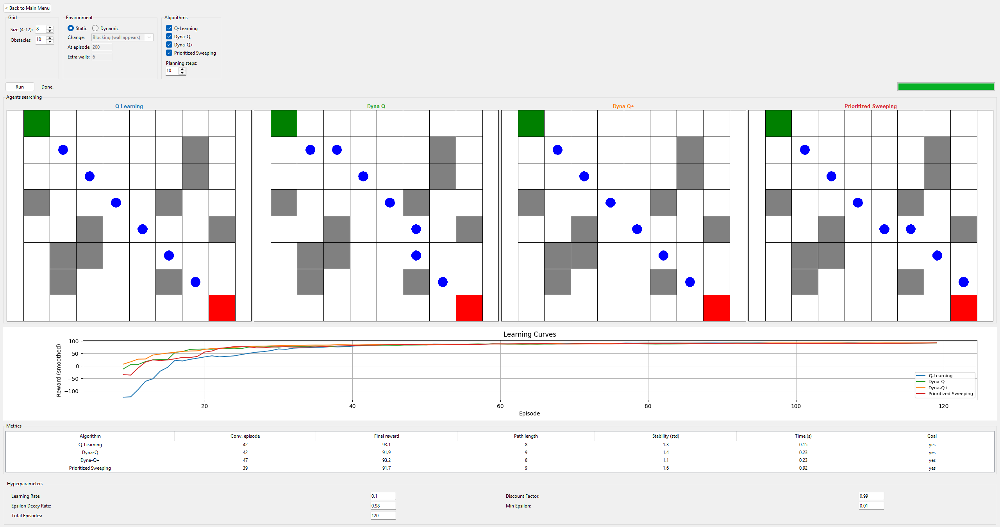
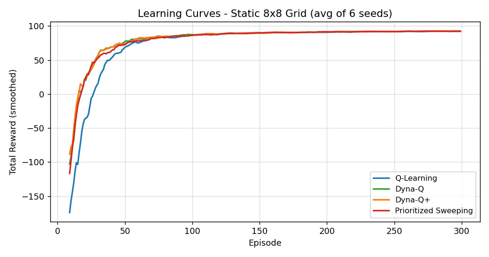
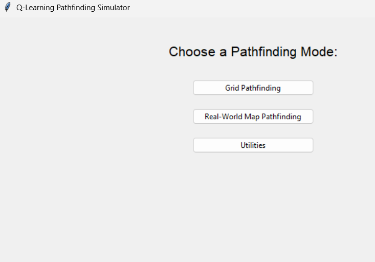
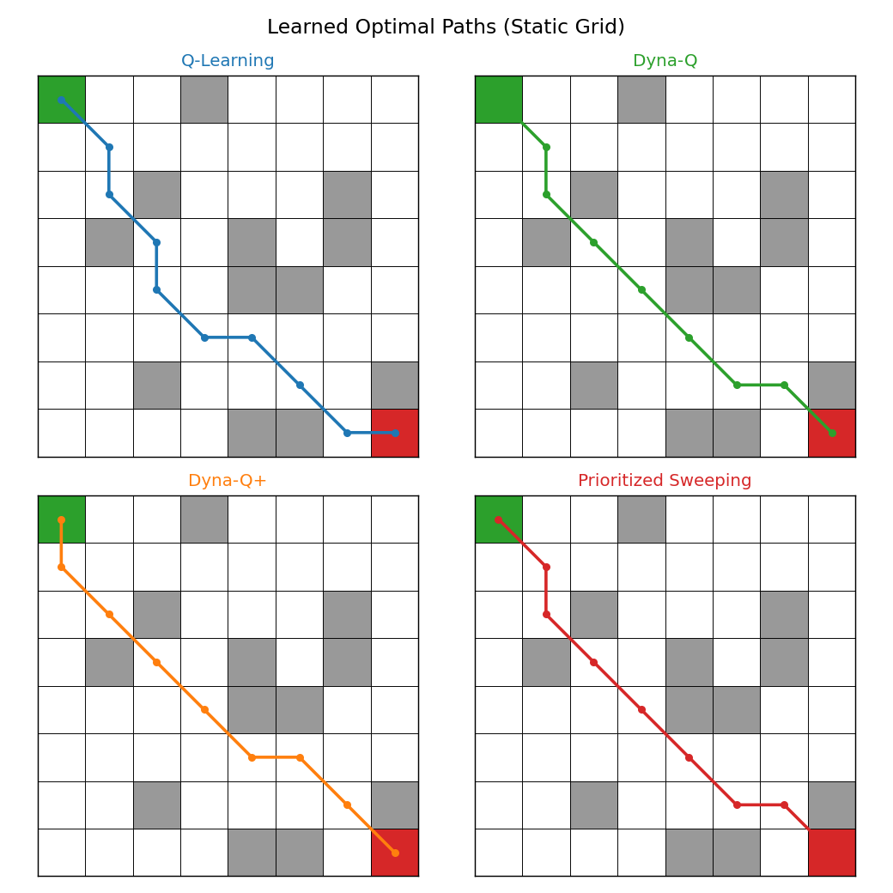
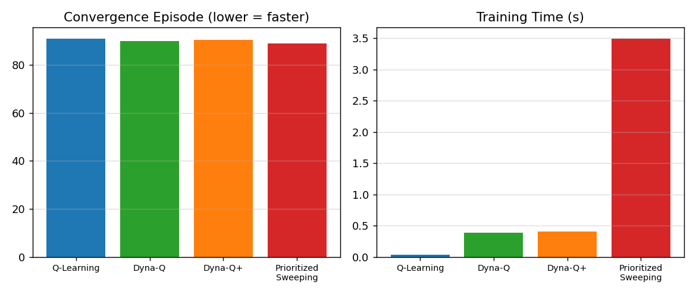
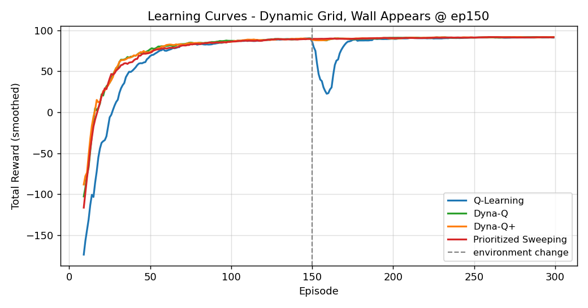

# Grid Navigation — RL Pathfinding with Model-Based Planning

A Python/Tkinter application for training, animating, and **comparing** reinforcement-learning agents on grid pathfinding — from a simple grid-world to real street maps pulled from OpenStreetMap.

It implements four tabular RL algorithms — **Q-Learning**, **Dyna-Q**, **Dyna-Q+**, and **Prioritized Sweeping** — and includes an interactive **Grid Pathfinding** screen where you pick any subset of them, run on an identical grid and seed, and watch every agent search live side by side, with overlaid learning curves and a metrics table underneath.



## Table of Contents

- [Features](#features)
- [Algorithms Implemented](#algorithms-implemented)
- [Getting Started](#getting-started)
- [Usage](#usage)
- [Project Structure](#project-structure)
- [Results](#results)
- [Real-World Map Mode](#real-world-map-mode)
- [Roadmap](#roadmap)
- [License](#license)

## Features

- 🧠 **Four RL algorithms** — model-free Q-Learning plus three model-based planning methods (Dyna-Q, Dyna-Q+, Prioritized Sweeping)
- 🧪 **Side-by-side comparison** — select any subset of the algorithms, train them on the same grid/seed, and watch each one search live on its own panel
- 🔁 **Static or dynamic environments** — a wall can appear mid-training to block the learned route, or open up as a shortcut, so you can see how each algorithm adapts
- 📊 **Quantitative metrics** — convergence episode, final reward, path length, stability (reward std-dev), and training time, plus overlaid learning-curve plots
- 🗺 **Real-world map mode** — download a street network for any place via [OSMnx](https://osmnx.readthedocs.io/), discretise it into a grid, and train an agent to navigate it
- ⚙️ **Adjustable hyperparameters** — learning rate, discount factor, epsilon decay, minimum epsilon, planning steps, all from the GUI
- 🧩 **Modular codebase** — the RL core has zero GUI/mapping dependencies, so it can be driven from a script or test in isolation

## Algorithms Implemented

| Algorithm | Type | Idea |
|---|---|---|
| **Q-Learning** | Model-free | Learns purely from real experience via the Bellman update. |
| **Dyna-Q** | Model-based | Q-Learning + a learned model of the environment; replays remembered transitions between real steps to learn faster. |
| **Dyna-Q+** | Model-based | Dyna-Q + an exploration bonus (`κ√τ`) for stale state-action pairs, so it keeps probing and adapts well when the environment changes. |
| **Prioritized Sweeping** | Model-based | Replays the highest-TD-error transitions first via a priority queue, propagating updates backward from the goal for faster, more targeted learning. |

On a static 8×8 grid, averaged over 6 seeds, the three planning algorithms converge in far fewer episodes than plain Q-Learning while reaching the same optimal policy:



## Getting Started

### Requirements

Grid mode only needs NumPy and Matplotlib. Real-world map mode additionally needs OSMnx (and pulls in its own geospatial dependencies).

```bash
git clone https://github.com/Daksh183/Grid-Navigation.git
cd Grid-Navigation
pip install -r requirements.txt
```

> If OSMnx isn't installed, the app still launches — only the Real-World Map view will warn you when you open it.

### Run

```bash
python main.py
```

## Usage

The app opens to a main menu with three modes:



### 1. Grid Pathfinding (the Experiment Lab)

- Configure grid size (4×4–12×12), obstacle count, and a **static** or **dynamic** environment (wall appears/blocking, or opens/shortcut, at a chosen episode)
- Tick any subset of the four algorithms — run just one, or all four at once
- Hit **Run**: every selected algorithm trains on the same grid and seed, then each is animated live on its own panel
- Below the grids: overlaid learning curves and a metrics table (convergence episode, final reward, path length, stability, training time, goal reached)

### 2. Real-World Map Pathfinding

- Enter a place name (e.g. `"Berkeley, CA"`) or `"Random Location"`
- The street network is downloaded via OSMnx, binned into a grid, and an agent is trained and animated over the real map

### 3. Utilities

- Print working directory, simulate a file upload, and a simple string-filtering tool

## Project Structure

The reinforcement-learning core has no GUI or mapping dependencies, so it can be reused from a script or test independently of the interface.

```
Grid-Navigation/
├── main.py                      # entry point — run this
├── requirements.txt
├── rl/                           # RL core (pure Python)
│   ├── config.py                 # actions, rewards, default hyperparameters
│   ├── environment.py            # state transitions, rewards, path checks, obstacles
│   ├── q_learning.py             # Q-Learning + optimal-path extraction
│   ├── dyna_q.py                 # Dyna-Q (planning from a learned model)
│   ├── dyna_q_plus.py            # Dyna-Q+ (planning + exploration bonus)
│   ├── prioritized_sweeping.py   # Prioritized Sweeping (priority-queue planning)
│   ├── algorithms.py             # registry mapping names -> trainers
│   └── metrics.py                # comparison metrics (convergence, stability, ...)
├── realworld/                    # OpenStreetMap integration (OSMnx, lazily imported)
│   ├── osm.py                    # download street graph, pick start/end nodes
│   └── grid.py                   # convert a street graph into a grid
├── gui/                          # Tkinter interface, one module per view
│   ├── base.py                   # shared state, hyperparameter panel, plotting
│   ├── comparison.py             # Grid Pathfinding / Experiment Lab view
│   ├── real_world.py             # real-world map view
│   ├── utilities.py              # utilities view
│   └── app.py                    # main window, wires the views together
└── utils/                        # dependency check, small text helpers
```

## Results

Every algorithm reaches the goal reliably; they differ in how fast they get there and how much it costs to train. Averaged over 6 seeds on an 8×8 grid with 12 obstacles:

| Algorithm | Convergence Ep. | Final Reward | Path Length | Stability (std) | Time (s) |
|---|---|---|---|---|---|
| Q-Learning | 91 | 92.3 | 9.2 | 1.2 | 0.04 |
| Dyna-Q | 90 | 92.5 | 9.0 | 0.8 | 0.39 |
| Dyna-Q+ | 90 | 92.6 | 9.0 | 0.8 | 0.41 |
| Prioritized Sweeping | 89 | 92.2 | 9.2 | 1.1 | 3.50 |

All four converge to essentially the same near-optimal path:



The trade-off is computational: the planning methods add per-step overhead (Prioritized Sweeping most of all, due to its priority-queue bookkeeping), which pays off more clearly on larger state spaces than this compact grid:



### Dynamic environments

When a wall appears mid-training (episode 150) and blocks the previously learned route, every agent dips and then recovers a new path. The model-based agents, which retain a reusable model of the environment, tend to adapt fastest — this is exactly the scenario Dyna-Q+'s exploration bonus is designed for:



## Real-World Map Mode

The real-world integration uses [OSMnx](https://osmnx.readthedocs.io/) to download a place's drivable street network, then bins node coordinates into a fixed-size grid (30×30 by default) so the same tabular RL core can train on it — no separate real-world algorithm needed. Cells with no street node become obstacles, and start/end points are snapped to the nearest walkable cell if needed.

## Roadmap

- [ ] Deep Q-Network (DQN) variant operating directly on the street graph, without the grid-discretisation step
- [ ] Multi-agent navigation (cooperative or competitive)
- [ ] Stochastic ("slippery") transitions
- [ ] SARSA (on-policy) as a further point of comparison

## License

This project is licensed under the [MIT License](LICENSE) — see the LICENSE file for details.

Originally based on a Q-Learning grid/real-world pathfinding demo, extended with Dyna-Q, Dyna-Q+, Prioritized Sweeping, dynamic environments, and the side-by-side Experiment Lab comparison tool.
